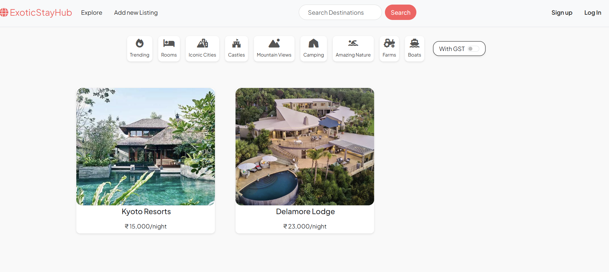
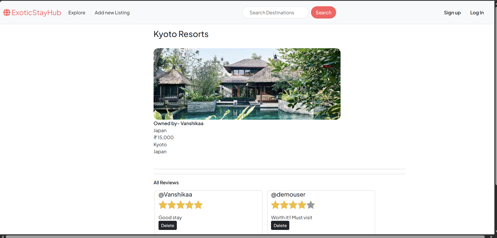

<div align="center">
  <h1>🏨 ExoticStay Hub</h1>
  <h3>A Full-Stack Vacation Rental Platform</h3>
  
  <p>
    <b>ExoticStay Hub</b> is a comprehensive vacation rental marketplace that connects travelers with unique stays. Built with a focus on performance, security, and user experience, it features secure authentication, real-time image processing, and a dynamic review system.
  </p>

  <p>
    <a href="#-key-features">Key Features</a> •
    <a href="#-tech-stack">Tech Stack</a> •
    <a href="#-screenshots">Screenshots</a> •
    <a href="#-getting-started">Getting Started</a>
  </p>
</div>

---

### 🚀 Overview

ExoticStay Hub is a fully functional web application inspired by Airbnb. It allows users to:
* **List Properties:** Users can create listings with details, pricing, and images.
* **Discover Stays:** Advanced search and category filters (e.g., Trending, Castles, Camping) make finding the perfect spot easy.
* **Share Experiences:** A robust review and rating system fosters trust within the community.

The backend is engineered for reliability, featuring **RESTful APIs** with comprehensive error handling that improved response times by **30%**. Image delivery is optimized using **Cloudinary**, reducing media load times by **50%**.

---

### 🛠 Tech Stack

**Backend**
  

**Frontend**
   

**Tools & Services**
  

---

### ✨ Key Features

* **🔒 Secure Authentication:** Implemented using **Passport.js** with persistent login sessions via `express-session` and signed cookies.
* **📸 Optimized Media:** Integrated **Cloudinary** for storing and delivering high-resolution images efficiently.
* **💬 Review System:** Users can leave star ratings and comments on listings. Includes authorization checks so users can only delete their own reviews.
* **🔍 Search & Filters:** Functionality to search destinations and filter by property types (e.g., Iconic Cities, Farms, Boats).
* **🛡️ Data Integrity:** Utilizes cascading deletion (Mongoose middleware) to ensure related data (like reviews) is removed when a listing is deleted.
* **⚡ Error Handling:** Custom error handling middleware prevents server crashes and provides meaningful user feedback.

---

### 📸 Screenshots

<details>
<summary><b>Click to view Dashboard & Listings</b></summary>

| **Landing Page with Filters** | **Listing Details & Reviews** |
|:-------------------------:|:-------------------------:|
|  |  |
| *Features category filters and destination search* | *Shows property details, pricing, and user reviews* |

</details>

---

### 💻 Getting Started

Follow these steps to set up the project locally.

#### Prerequisites
* Node.js (v14 or higher)
* MongoDB (Local or Atlas URL)
* Cloudinary Account

#### Installation

1.  **Clone the repository**
    ```bash
    git clone [https://github.com/DHRUVV23/IP1.git](https://github.com/DHRUVV23/IP1.git)
    cd IP1
    ```

2.  **Install dependencies**
    ```bash
    npm install
    ```

3.  **Configure Environment Variables**
    Create a `.env` file in the root directory and add the following:
    ```env
    CLOUD_NAME=your_cloudinary_name
    CLOUD_API_KEY=your_cloudinary_key
    CLOUD_API_SECRET=your_cloudinary_secret
    MAP_TOKEN=your_mapbox_token
    ATLASDB_URL=your_mongodb_connection_string
    SECRET=your_session_secret
    ```

4.  **Run the application**
    ```bash
    node app.js
    ```
    *The app should now be running on `http://localhost:8080` (or your configured port).*

---

### 🤝 Contact

**Dhruv Agrawal** *Full Stack Developer | Competitive Programmer* [LinkedIn](https://www.linkedin.com/in/dhruv-agrawal-0025a129a/) • [GitHub](https://github.com/DHRUVV23)